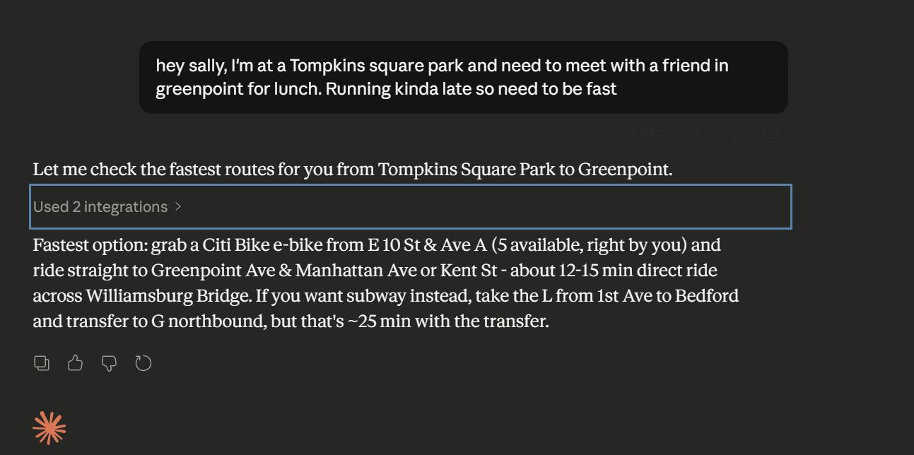
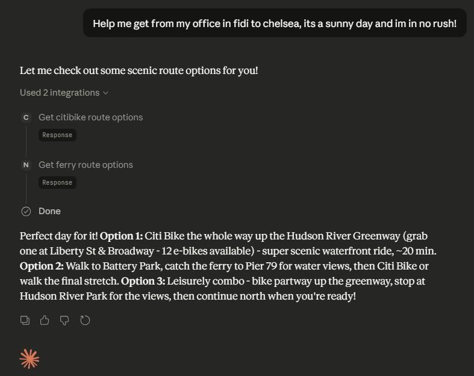

# Sally — Your NYC Commute Copilot 🚇🚲⛴️

> Think of it as having your own "guy in a chair" for getting around New York City.

## What is this?

Sally is an AI-powered transportation agent that connects to real-time NYC transit data so you can plan creative, multimodal commutes using natural language.

The problem: getting around NYC with a mix of subway, Citi Bike, and ferry means checking across multiple apps, mentally stitching together schedules, and hoping nothing changed in the last 5 minutes. Sally pulls live data from all three and gives you actual route options — with personality.

You talk to Sally the way you'd text a friend who knows the transit system inside out:

> "hey sally, I'm at Tompkins Square Park and need to meet a friend in Greenpoint for lunch. Running late so need to be fast"

And Sally comes back with real options using live availability data:






## How it works

Sally is built on [MCP (Model Context Protocol)](https://modelcontextprotocol.io/) servers that give an LLM access to real-time transit APIs. The architecture is intentionally simple — each transit source gets its own MCP server, and the LLM orchestrates across them to plan routes.

```
User (natural language) → LLM + Sally prompt → MCP servers → Live transit APIs
                                                  ├── MTA Subway (GTFS real-time)
                                                  ├── Citi Bike (GBFS)
                                                  └── NYC Ferry (GTFS + GTFS-RT)
```

The LLM doesn't hallucinate routes — it calls tools to check real station availability, live train arrivals, and ferry schedules before suggesting anything.

## Features

### 🚇 MTA Subway
- Real-time train arrivals via GTFS feeds
- Nearby station discovery with walk time estimates
- Direct and single-transfer route planning between any two locations

### 🚲 Citi Bike
- Live station availability (classic bikes, e-bikes, open docks)
- Pickup and dropoff station matching for bike legs
- Radius-based station search

### ⛴️ NYC Ferry
- Scheduled departures with real-time delay updates
- Nearby ferry terminal discovery
- Direct ferry route matching between origin and destination

## Getting started

### Prerequisites
- Python 3.10+
- [uv](https://github.com/astral-sh/uv) (for running MCP servers)
- An MCP-compatible client (e.g., Claude Desktop)

### Setup

1. Clone the repo:
```bash
git clone https://github.com/YOUR_USERNAME/sally.git
cd sally
```

2. Install dependencies:
```bash
uv sync
```

3. Configure your MCP client using the provided `.mcp.json`, or add the servers manually:
```json
{
  "mcpServers": {
    "mta-subway": {
      "command": "uv",
      "args": ["run", "python", "mta.py"]
    },
    "citibikes": {
      "command": "uv",
      "args": ["run", "python", "citibikes.py"]
    },
    "nyc-ferry": {
      "command": "uv",
      "args": ["run", "python", "ferry_data.py"]
    }
  }
}
```

4. Load Sally's system prompt from `prompts/sally_system_prompt.md` into your MCP client to get the full personality and routing behavior.

## Project structure

```
├── mta.py              # MTA subway MCP server (GTFS real-time feeds)
├── citibikes.py        # Citi Bike MCP server (GBFS API)
├── ferry_data.py       # NYC Ferry MCP server (GTFS + GTFS-RT)
├── prompts/
│   └── sally_system_prompt.md  # Sally's personality and routing instructions
├── data/
│   ├── ferry_data.json                           # Pre-processed ferry stop/route data
│   └── MTA_Subway_Stations_and_Complexes_*.csv   # MTA station reference data
└── .mcp.json           # MCP server configuration
```

## Roadmap

- [x] Citi Bike real-time data integration
- [x] MTA subway real-time arrivals and routing
- [x] Ferry schedule and real-time delay data
- [x] System prompt with personality and routing guidelines
- [ ] WhatsApp chat agent integration
- [ ] Multi-modal route scoring and ranking
- [ ] Agent framework for autonomous trip planning
- [ ] Fine-tuned model for NYC transit domain knowledge

## Data sources

- [MTA GTFS Real-Time Feeds](https://api.mta.info/)
- [Citi Bike GBFS Feed](https://citibikenyc.com/system-data)
- [NYC Ferry GTFS Data](https://www.ferry.nyc/)

## Contributing

This is a work in progress and I'd love help. If you're interested in transit data, MCP servers, or agent development, open an issue or reach out.

---

*Built in NYC, for NYC commuters who are tired of checking 5 apps.*